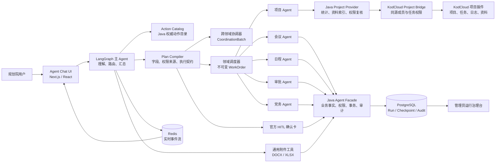

# KodAgent

> 面向规划院内部协同办公的可控多 Agent 系统：让自然语言进入真实业务流程，而不是绕过权限和规则直接操作数据。

<p align="left">
  
  
  
  
  
  
  
  
</p>

KodAgent 服务于规划院内部的项目协同和日常 OA 场景。它把模型放在“理解、调查、组织表达”的位置，把权限、业务事实、状态机、人工确认和最终事务留在确定性系统中。

**模型负责提出和解释，系统负责验证和执行。**

## 项目概览

### 对话与过程展示

<p align="center">
  
</p>

<p align="center"><sub>自然语言入口与状态驱动的过程时间线：只展示过程摘要、工具活动、确认和最终回答，不展示内部路由协议或隐藏推理。</sub></p>

### 受控业务执行

<table>
  <tr>
    <td width="50%" valign="top">
      <strong>多轮任务执行</strong><br />
      <sub>项目调查、附件制作与 Word 交付均保留可追踪过程事件。</sub><br /><br />
      
    </td>
    <td width="50%" valign="top">
      <strong>人工确认边界</strong><br />
      <sub>写操作先形成草稿，由官方确认卡恢复既有操作后才提交。</sub><br /><br />
      
    </td>
  </tr>
</table>

### 运行治理与模型管理

<table>
  <tr>
    <td width="50%" valign="top">
      <strong>运行治理台</strong><br />
      <sub>查看运行趋势、失败链路、工具健康度和执行漏斗。</sub><br /><br />
      
    </td>
    <td width="50%" valign="top">
      <strong>模型供应商管理</strong><br />
      <sub>统一管理兼容 OpenAI 协议的供应商、连通性和模型目录。</sub><br /><br />
      
    </td>
  </tr>
</table>

<details>
<summary><strong>查看可交互执行拓扑</strong></summary>
<br />
<p align="center">
  
</p>
<p align="center"><sub>按主 Agent、领域执行、业务 Operation、HITL 和跨领域协调呈现真实运行事件；支持缩放、平移与节点指标查看。</sub></p>
</details>

## 解决的问题

规划院的协同工作并不缺聊天入口，缺的是一个能安全进入既有业务系统的入口：

- 同一问题同时涉及项目、会议、日程或审批，人工需要在多个系统间切换、比对和汇总。
- 项目进度、责任分工、任务日志、资料与制度要求分散在 KodCloud 项目插件和 OA 中，容易形成“口头进度”。
- 会议取消、日程调整、审批处理、文件发布等写操作必须遵守权限、流程状态和人工确认，不能因模型一句话直接落库。
- 运行失败时，需要知道失败在哪个阶段、输入是什么、哪个工具或模型导致失败，而不是只看到“系统异常”。

KodAgent 的目标是把这些工作收敛成一条可解释、可复核、可恢复的业务链路。

## 一个真实场景

用户说：

> “下周一要给领导汇报，帮我把负责项目这周的推进情况整理详细一点，给我 Word。”

系统不是直接套周报模板，而是按下列链路执行：

```text
用户问题
  -> 定位当前用户可访问的项目（多项目时展示候选，不猜选）
  -> 编译 project.investigate 只读调查计划
  -> projects_agent 读取确定性统计、任务、成员、动态与资料状态
  -> Java Project Provider 复核 KodCloud 成员权限与任务隐私
  -> 主 Agent 基于真实事实组织周报正文
  -> 用户明确要求 Word 时，模型调用通用附件工具撰写 DOCX
  -> Java 受控存储、按当前用户签发短期下载授权
```

其中完成率、逾期、无负责人、近期无活动等数字由 Java 按项目配置计算；模型不能自行计算或虚构。文档的标题、结构和正文由模型结合用户要求与已核实事实撰写，但 DOCX/XLSX 的交付必须有 Java 回执。用户只要求 Word 时，不会附带生成 Excel。

## 核心能力

### 项目智能助手（一期只读）

- 查询当前用户可参与项目、项目概览、任务树、成员负责情况和近期动态。
- 基于项目设置计算完成率、逾期、无负责人、停滞任务、数据缺口与风险清单。
- 检索项目资料目录及管理员维护的制度资料，结果带版本与引用依据。
- 支持自然语言调查：例如“这个项目卡在哪里”“张三负责的事项怎么样”“近七天没更新的任务有哪些”。
- 按用户明确需求生成 DOCX 或 XLSX 附件；附件内容由模型撰写，文件存储、下载授权与格式回执由 Java 控制。

项目、任务和文件的创建或修改**尚未开放给 Agent**。后续若开放，必须进入既有“意图 → 编译 → 草稿 → HITL → 执行 → 回执”链路。

### 日常 OA 协作

| 领域 | 已接入能力 | 写操作边界 |
| --- | --- | --- |
| 会议预约 | 查询、创建、修改、取消、冲突核验 | 草稿 + 官方确认卡 |
| 个人日程 | 查询、创建、修改、取消 | 草稿 + 官方确认卡 |
| 审批 | 待办、已办、我发起的审批、发起/处理/撤回 | 状态与权限校验 + HITL |
| 党务文件 | 元数据检索、内容检索、版本比较、合规检查、草稿发布/修改/删除 | 权限校验 + HITL |
| 项目资料 | 项目、任务、动态、资料、制度检索、进度分析 | 一期严格只读 |

### 跨领域协同

一个请求可被拆成 2 至 4 个独立领域步骤。主 Agent 只负责理解、编译和汇总；每个领域子 Agent 只接收不可变的 WorkOrder，并在自身受限工具范围内执行。步骤结果通过结构化回执汇总，某个分支失败不会扩大其他分支的权限或执行范围。

### 运行治理

- 每次 Run 保存用户输入、路由、编译、委派、工具、确认、最终回答和失败原因。
- 管理员可从“最近运行”进入单条链路，查看输入提示词及每个节点的时间、结果和错误。
- 运行趋势、失败信号、工具健康度与交互式执行拓扑均来自持久化事件，不依赖前端临时状态。
- 过程区展示 `report_progress` 和工具事件；最终聊天正文只接收标记为 `final` 的模型回复，控制消息不会先显示再被固定文案覆盖。

## 架构



### 职责边界

| 层 | 负责什么 | 不负责什么 |
| --- | --- | --- |
| 模型与 Agent | 识别用户目标、选择已注册能力、调查顺序、解释事实、撰写附件内容 | 业务事实、权限判断、最终写入、下载授权 |
| Python 编排层 | 路由、计划编译、工具可见性、子 Agent 委派、输出展示契约 | 直接访问 OA/KodCloud 数据库、替模型编写业务正文 |
| Java Facade / Provider | Action Catalog、身份、权限、统计口径、业务事务、附件存储、审计 | 把业务规则复制进提示词 |
| KodCloud 项目桥接 | 复用项目插件成员权限、`taskShowOnlySelf`、资料目录权限并输出稳定 JSON | 复用浏览器 Cookie、向 Agent 暴露文件路径/下载令牌 |
| 前端 | 渲染状态、过程摘要、工具活动、HITL 与附件 | 从原始模型消息猜测业务状态 |

## 安全与可靠性设计

- **契约优先**：动作、字段、枚举、权限和执行器来自 Java Action Catalog；Python 每个 Run 同步并校验，目录漂移可被严格模式阻止。
- **候选不是事实源**：对话上下文和候选只帮助定位“刚才那一项”；修改、取消和提交前仍必须回到 Java 查询真实对象并重验权限。
- **写入必须确认**：模型不能替用户点击确认卡。草稿、Operation、HITL 恢复和 Java 事务共同构成写操作闭环。
- **项目权限同源**：OA 用户映射为 KodCloud 用户；项目成员、任务私密设置与文件权限由项目插件实时复核，不使用共享账号降级查询。
- **附件受控交付**：模型只写内容，不构造下载地址；Java 生成并存储附件，前端只消费 Java 签发的元数据和短期授权。
- **输出通道分离**：过程摘要、最终回答、内部控制和结构化卡片走不同契约，避免中间模型文本污染聊天历史。
- **可审计事件**：审计记录用户、数据快照、规则版本、资料版本、运行阶段和失败原因；不记录文件正文、访问令牌或模型密钥。

## 技术栈

| 层级 | 技术 |
| --- | --- |
| Agent Runtime | Python、LangGraph、DeepAgents、Pydantic |
| 业务与集成 | Java、Spring Boot、MyBatis、Flowable/BPM |
| Web UI | Next.js、React、TypeScript、React Flow |
| OA / 文件协同 | 芋道源码 OA、KodCloud 项目插件 |
| 数据与事件 | PostgreSQL、Redis、Docker Compose |

## 仓库结构

```text
.
├── agent-python/             # 主图、编排、子 Agent、工具、Skills、运行时
├── agent-chat-ui/            # 对话、过程时间线、HITL、附件与运行治理台
├── yudao-server/             # Java Facade、Action Catalog、权限、事务、统计与审计
├── yudao-module-*/           # 审批、组织、会议、日程、党务等 OA 业务模块
├── script/kodbox/plugins/    # KodCloud 插件；project 含 Agent 只读桥接层
├── sql/                      # Agent 运行事件、项目知识库与映射相关表结构
├── scripts/                  # 本地初始化、迁移、验收和运行脚本
├── docs/images/              # README 截图资源
└── process-compose.yaml      # 本地多进程编排入口
```

## 本地开发

### 前置条件

- JDK 8+、Maven
- Python 3.11+、`uv`
- Node.js 20+、pnpm
- Docker Desktop、PostgreSQL、Redis
- 本地 OA 与 KodCloud 实例

### 启动开发服务

```bash
git clone <your-repository-url> kodagent
cd kodagent

# 按各模块 .env.example 和 application-local.yaml 配置本地环境。
# 不要提交模型 Key、SSO 密钥、数据库口令或 KodCloud 桥接密钥。
process-compose -f process-compose.yaml -p 18080 up -D
```

默认本地入口：

- Agent Chat UI：`http://127.0.0.1:3000`
- LangGraph Runtime：`http://127.0.0.1:2024`
- Java Agent Facade：`http://127.0.0.1:48080`
- OA 管理后台：`http://127.0.0.1:5666`
- KodCloud：`http://127.0.0.1:8001`

### 常用验证

```bash
# Python Agent
cd agent-python
uv run pytest

# Chat UI
cd ../agent-chat-ui
pnpm typecheck
pnpm build

# Java Facade
cd ../yudao-server
mvn -DskipTests package
```

## 当前范围与后续方向

- [x] 统一 Action Catalog、计划编译与受控子 Agent 委派
- [x] 会议、日程、审批、党务文件的查询与写操作 HITL 闭环
- [x] 项目资料、任务、动态、制度检索与确定性风险分析
- [x] 通用 DOCX/XLSX 附件交付与受控下载授权
- [x] 跨领域协调执行、Run 审计、管理员运行治理台与交互式执行拓扑
- [ ] 基于真实运行数据完善路由评测集、提示词评估和工具契约质量指标
- [ ] 在不破坏 HITL 边界的前提下开放项目/任务写操作

## License

内部项目。未经授权不得用于外部部署、分发或处理非授权业务数据。
