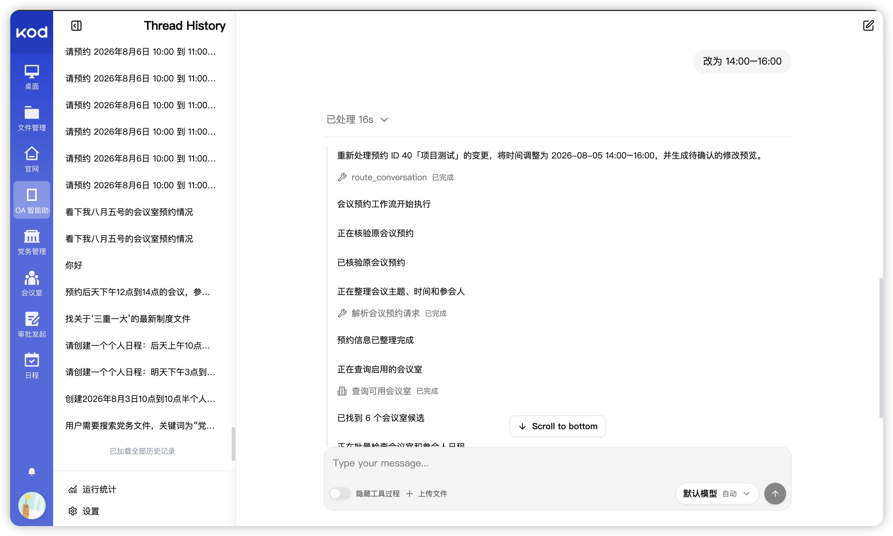
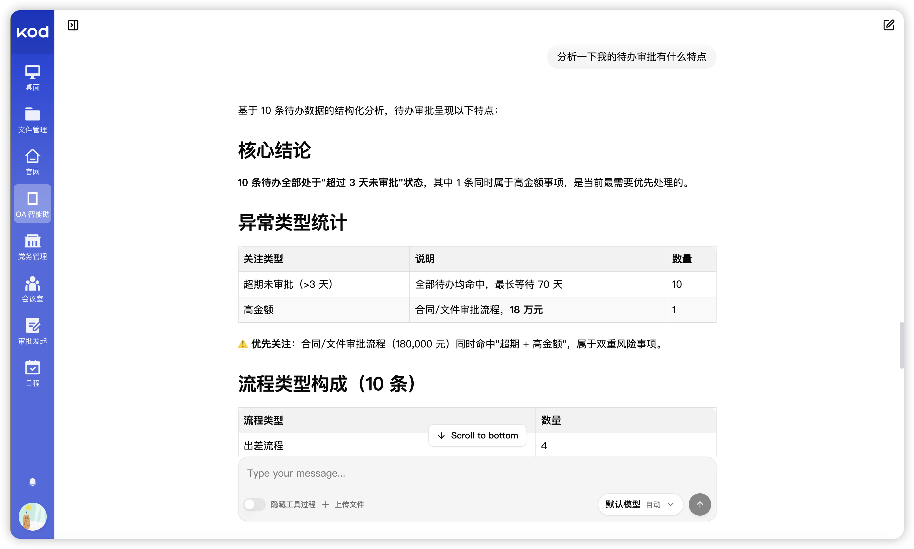
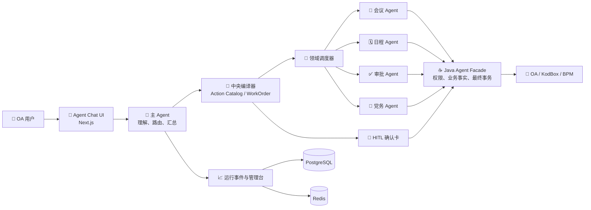

# 🤖 KodAgent

面向规划院内部办公场景的多 Agent OA 协作系统。用户通过自然语言完成会议预约、个人日程、审批和党务文件等任务；系统把模型理解转化为可校验的业务计划，并在真实 OA 数据、权限和人工确认边界内执行。

<p align="left">
  
  
  
  
  
  
  
  
  
  
</p>

> 模型负责理解与规划，业务系统负责事实、权限和最终写入。

## 🖼️ 项目概览

### 对话入口

<p align="center">
  
</p>

<p align="center"><sub>自然语言入口，覆盖审批、日程、会议预约和党务文件等常用办公任务。</sub></p>

### 业务执行与人工确认

<table>
  <tr>
    <td width="50%" valign="top">
      <strong>多轮任务执行</strong><br />
      <sub>展示路由、查询、工作流执行与过程结果。</sub><br /><br />
      
    </td>
    <td width="50%" valign="top">
      <strong>写操作确认卡</strong><br />
      <sub>修改会议预约先生成草稿，用户确认后才提交。</sub><br /><br />
      
    </td>
  </tr>
</table>

### 审批洞察与运行观测

<table>
  <tr>
    <td width="50%" valign="top">
      <strong>审批待办洞察</strong><br />
      <sub>基于授权的待办数据生成风险与优先级分析。</sub><br /><br />
      
    </td>
    <td width="50%" valign="top">
      <strong>管理员运行台</strong><br />
      <sub>查看运行趋势、关键漏斗、失败信号和工具健康度。</sub><br /><br />
      
    </td>
  </tr>
</table>

#### 可交互执行拓扑

<p align="center">
  
</p>

<p align="center"><sub>按主 Agent、领域执行、业务 Operation、人工确认和跨领域协调呈现真实运行事件，可缩放、平移并查看节点指标。</sub></p>

### 模型供应商管理

<p align="center">
  
</p>

<p align="center"><sub>统一管理兼容 OpenAI 协议的模型供应商、连接检测和模型同步。</sub></p>

## 🎯 解决什么问题

- 🗓️ **日常办公**：查询、新增、修改或取消会议预约与个人日程。
- ✅ **审批协作**：查询待办、发起审批、生成草稿，并在确认后提交。
- 📁 **党务文件**：检索、理解、发布和阅读状态跟踪。
- 🔄 **跨领域任务**：把一个请求编译成多个领域步骤，由对应子 Agent 执行并汇总结果。
- 📊 **运行治理**：管理员可查看运行趋势、失败链路、工具健康和可缩放的执行拓扑。

## 🧭 核心目标

1. **自然交互**：支持多轮对话、上下文候选、续办与澄清。
2. **可靠执行**：所有业务动作先经过领域路由、计划编译和动作契约校验。
3. **可控写入**：写操作默认生成草稿，通过官方 HITL 确认卡后才提交。
4. **可审计运行**：Run、阶段事件、业务 Operation 和跨领域协调状态均可追踪。

## 🏗️ 架构



### 关键设计

- **中央编译，领域执行**：主 Agent 不直接拼接低层工具调用；它负责路由、编译和结果汇总，子 Agent 只执行已编译的领域 WorkOrder。
- **契约优先**：动作、字段、风险等级、执行器和工具能力由 Java Action Catalog 与 Python 执行契约共同校验，不依赖提示词“记住规则”。
- **记忆只作线索**：对话候选帮助理解“刚才那条”，但任何修改、取消或提交都会重新查询并校验真实业务对象。
- **安全闭环**：草稿、审批、权限、ID 来源、幂等与状态机共同约束写操作。
- **可观测性**：`agent_run`、`agent_run_event`、Operation 与协调批次构成运行事实源；管理台不展示 Prompt、隐藏推理或原始敏感工具结果。

## 🧩 技术栈

| 层级 | 技术 |
| --- | --- |
| Agent 运行时 | Python、LangGraph、DeepAgents、Pydantic |
| 业务服务 | Java、Spring Boot、MyBatis、Flowable/BPM |
| Agent UI | Next.js、React、TypeScript、React Flow |
| OA 前台 | Vue 3、Vben Admin |
| 基础设施 | PostgreSQL、Redis、Docker Compose、KodBox |

## 📂 目录结构

```text
.
├── agent-python/       # LangGraph 主图、子 Agent、工具、工作流与运行时
├── agent-chat-ui/      # 对话界面、确认卡与管理员运行台
├── yudao-server/       # Java Agent Facade、权限、业务事务与统计接口
├── yudao-module-*/     # 审批、组织、日程、会议、党务等 OA 业务模块
├── yudao-ui/           # OA 管理后台
├── script/             # KodBox、数据库和本地启动脚本
└── process-compose.yaml # 本地多进程编排入口
```

## 🚀 本地启动

### 前置条件

- JDK 8+、Maven
- Python 3.11+ 与 `uv`
- Node.js 20+、pnpm
- Docker Desktop、PostgreSQL、Redis
- KodBox 本地实例与项目级环境变量

### 启动全部开发服务

```bash
git clone <your-repository-url> kodagent
cd kodagent

# 按项目环境模板配置 Java、Python、模型和 KodBox 参数。
# 不要提交任何 .env 或真实密钥。
process-compose -f process-compose.yaml -p 18080 up -D
```

默认本地入口：

- Agent Chat UI：`http://127.0.0.1:3000`
- LangGraph：`http://127.0.0.1:2024`
- Java Agent Facade：`http://127.0.0.1:48080`
- OA 管理后台：`http://127.0.0.1:5666`

### 常用验证

```bash
cd agent-chat-ui && pnpm typecheck && pnpm build
cd .. && mvn -f yudao-server/pom.xml -DskipTests package
```

## 🔐 安全边界

- 不提交真实账号、数据库密码、模型 Key、SSO 密钥或部署地址。
- Python Agent 不直接写业务数据库，业务写入始终通过 Java Facade 和 OA 业务服务。
- 任何模型建议都不是执行授权；目标 ID 必须来自授权查询结果，写操作必须经过业务状态与确认校验。

## 🗺️ 路线图

- [x] 领域子 Agent 与统一动作契约
- [x] 写操作草稿与 HITL 确认
- [x] 跨领域任务编译与协调执行
- [x] 管理员运行统计、失败追踪与交互式执行拓扑
- [ ] 基于线上运行数据持续优化路由、提示词和工具契约

## 📄 License

内部项目，未经授权不得用于外部部署或分发。
