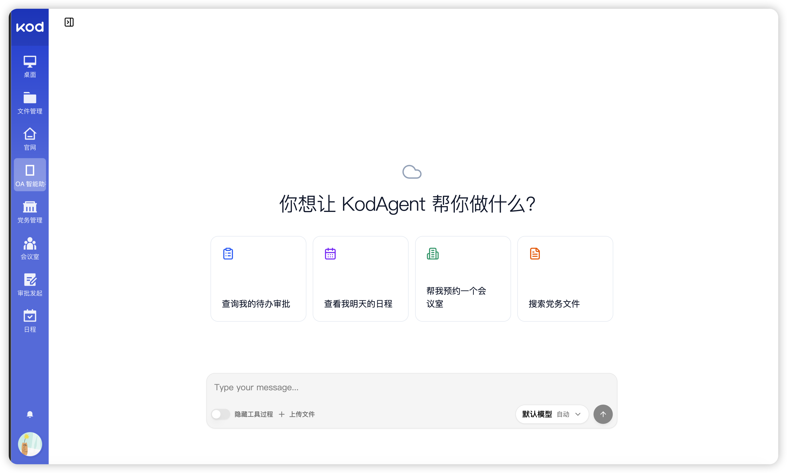
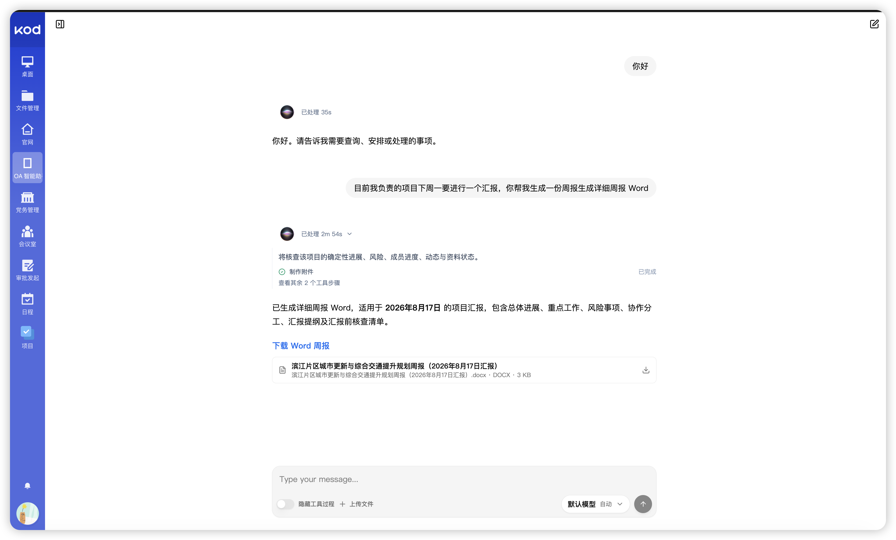
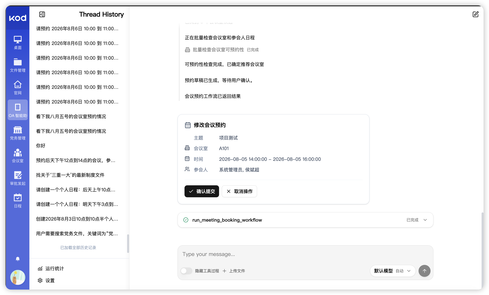
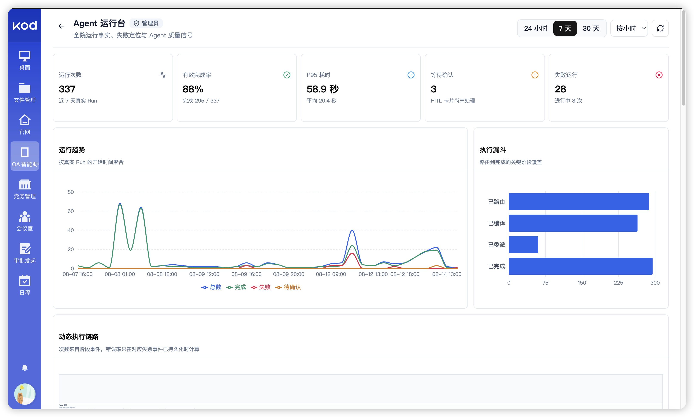
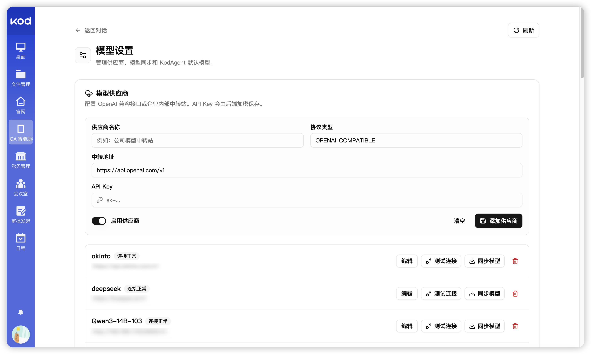
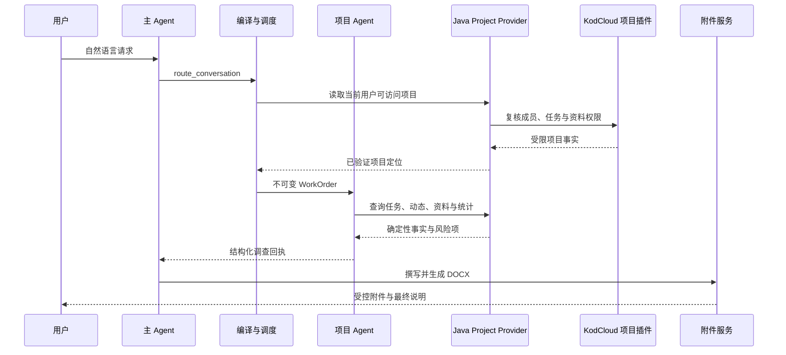
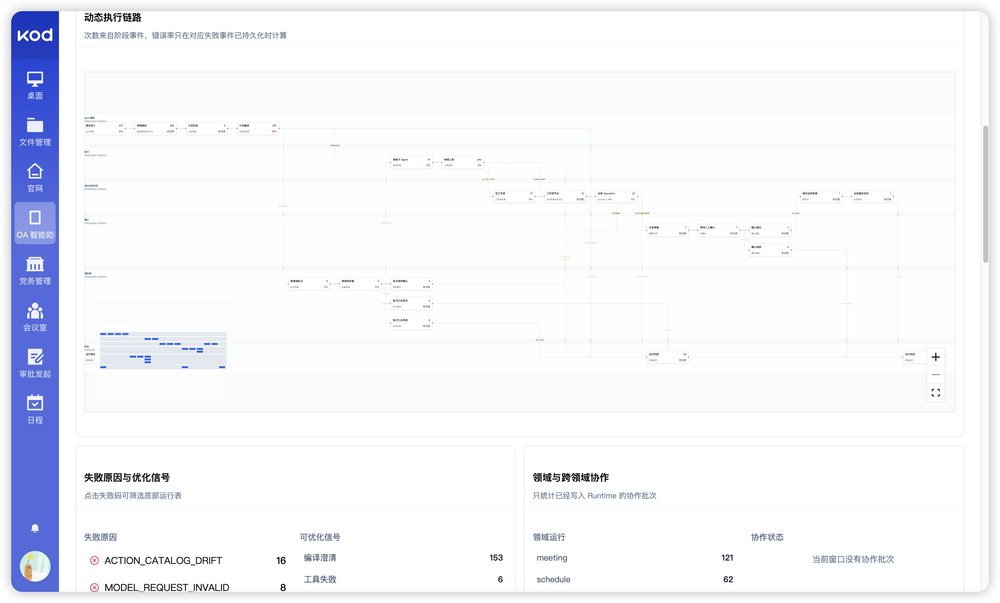
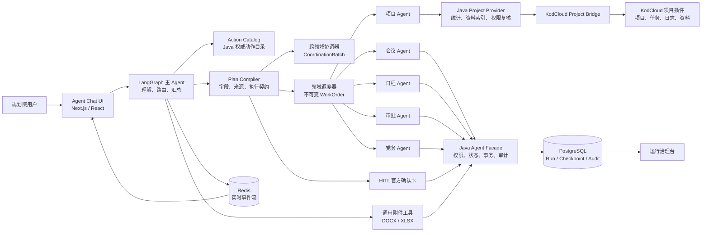

# KodAgent

> 面向规划设计机构的可信多 Agent 协同平台。它把自然语言请求带入项目管理与 OA 的真实业务链路，同时将权限、事实、确认和事务保留在确定性系统中。

<p align="left">
  
  
  
  
  
  
  
</p>

## 🧭 项目概览

KodAgent 不是把 OA 系统的接口直接交给模型调用。模型负责理解目标、规划调查、组织回答与撰写文件；动作目录、数据权限、业务状态、人工确认、文件交付和审计由可验证的系统契约负责。

<p align="center">
  
</p>

<p align="center"><sub>对话过程按状态展示摘要、工具活动、确认与最终回答；内部路由协议和隐藏推理不会进入用户可见消息流。</sub></p>

<table>
  <tr>
    <td width="50%" valign="top">
      <strong>多轮任务执行</strong><br />
      <sub>从项目调查、领域委派到文件交付，关键步骤均可追踪、可回放。</sub><br /><br />
      
    </td>
    <td width="50%" valign="top">
      <strong>人工确认边界</strong><br />
      <sub>写操作先形成草稿，只有用户在官方确认卡中确认后才会提交。</sub><br /><br />
      
    </td>
  </tr>
  <tr>
    <td width="50%" valign="top">
      <strong>运行治理台</strong><br />
      <sub>集中查看运行趋势、失败链路、工具健康度和执行漏斗。</sub><br /><br />
      
    </td>
    <td width="50%" valign="top">
      <strong>模型供应商管理</strong><br />
      <sub>统一管理兼容 OpenAI 协议的模型供应商、模型目录与连通性。</sub><br /><br />
      
    </td>
  </tr>
</table>

## ✨ 解决的问题

规划设计机构的协同工作往往跨越项目任务、进度资料、会议、日程、审批和制度文件。信息散落在多个业务系统中，人工汇总费时，直接让模型操作业务数据又不可接受。

KodAgent 提供一个受控入口：

- 把“项目现在卡在哪里”“下周汇报要准备什么”“会议改到什么时候”转化为可验证的业务计划。
- 在多个领域之间并行调查、独立执行并汇总结果，不让一个分支的失败扩大到其他领域。
- 基于真实任务、动态、资料与制度要求生成说明、周报、分析报告和数据工作簿。
- 所有写操作经过权限校验、草稿、HITL 确认与事务提交，不以模型文本代替用户确认。
- 将每次运行的用户输入、路由、工具、耗时、失败原因和最终交付保留为可检索的运行记录。

## 🚀 一个请求如何执行

用户输入：

> “下周一要给领导汇报，帮我把负责项目这周的推进情况整理详细一点，给我 Word。”



模型可以自主决定调查顺序和表达方式，但不能绕过以下边界：项目成员权限由 KodCloud 插件复核，完成率和逾期由 Java 统一计算，附件下载由服务端按当前用户授权。

## 🧩 产品能力

### 项目智能助手

- 查询项目概览、任务树、成员负责情况、项目动态和资料目录。
- 识别完成率、逾期、无负责人、近期无活动、数据缺口和待协调事项。
- 同时检索项目资料与制度知识库，结果保留版本和引用依据。
- 根据事实自动组织周报、阶段汇报、风险分析、人员分工和数据工作簿。
- 支持 DOCX / XLSX 附件交付、下载与侧栏预览。

### OA 业务协作

| 领域 | 典型能力 | 执行保障 |
| --- | --- | --- |
| 会议预约 | 查询、创建、修改、取消、冲突核验 | 草稿 + 官方确认卡 |
| 个人日程 | 查询、创建、修改、取消 | 草稿 + 官方确认卡 |
| 审批 | 待办、已办、我发起的审批、发起、处理、撤回 | 状态校验 + HITL |
| 党务文件 | 检索、详情、版本比较、合规检查、发布、修改、删除 | 权限校验 + HITL |
| 项目资料 | 项目、任务、动态、资料、制度检索与进度分析 | KodCloud 同源权限复核 |

### 多 Agent 协同

- 主 Agent 负责理解用户目标、选择能力、汇总事实与生成最终回答。
- 领域 Agent 在会议、日程、审批、党务、项目等受限工具范围内独立执行。
- 多领域请求被编译为结构化步骤；各步骤并行调度、隔离失败，并通过结构化回执收敛。
- 每份 WorkOrder 都由代码签发，领域 Agent 无法自行扩大动作范围、替换执行器或伪造来源字段。

### 文件与知识能力

- 项目资料与制度文件进入受控知识索引，检索结果返回前重新复核访问权限。
- 支持 PDF、DOCX、XLSX、TXT、Markdown 等资料的提取、版本识别和引用。
- 模型根据已验证事实自由组织文档正文或工作簿结构；服务端只负责格式校验、存储、预览和下载授权。

### 运行治理

- 运行趋势、节点耗时、工具调用量、失败率和模型健康度基于持久化事件计算。
- 管理员可从最近运行直接进入单条链路，查看用户输入、过程摘要、节点结果和错误原因。
- 支持可缩放、可平移的执行拓扑，定位高频节点、异常分支与运行瓶颈。

<details>
<summary><strong>查看执行拓扑</strong></summary>
<br />
<p align="center">
  
</p>
</details>

## 🏗️ 架构



| 层 | 职责 |
| --- | --- |
| Agent 层 | 识别目标、规划调查、组织解释、撰写文档内容 |
| Python 编排层 | 路由、计划编译、工具裁剪、领域委派、输出展示契约 |
| Java 业务层 | 动作目录、身份权限、统计口径、业务事务、附件与审计 |
| KodCloud 桥接层 | 项目成员、任务隐私、资料目录和文件权限的同源校验 |
| 前端 | 对话、过程摘要、工具活动、确认、附件和运行治理展示 |

## 🔐 可信执行模型

KodAgent 的核心不是“让模型记住更多”，而是让不同职责由正确的系统承担。

- **动作目录是权威源**：能力、字段、枚举、风险和执行器由 Java Action Catalog 提供，Python 在运行时同步校验。
- **候选不是事实源**：对话上下文只帮助定位“刚才那一项”；真正执行前仍会回到 Java 和业务系统重新校验。
- **写入必须确认**：模型只能提出草稿，不能代替用户提交；确认卡恢复已有操作，Java 才执行最终事务。
- **项目权限同源**：OA 用户映射为 KodCloud 用户；成员关系、任务私密设置与资料权限均由项目插件实时判断。
- **输出通道分离**：过程摘要、最终回答、内部控制和结构化卡片使用不同契约，避免中间消息污染聊天历史。
- **附件受控交付**：模型不构造下载地址；服务端生成、保存并按当前身份提供下载和预览。
- **完整审计链路**：运行记录保存数据快照、规则版本、领域步骤、工具结果和失败原因，不记录访问令牌或模型密钥。

## 🛠️ 本地运行

### 前置条件

- JDK 8+ 与 Maven
- Python 3.11+ 与 `uv`
- Node.js 20+ 与 `pnpm`
- Docker Desktop、PostgreSQL、Redis
- 可访问的 OA 与 KodCloud 实例

### 启动

```bash
git clone https://github.com/zhaoyongze123/KodAgent.git KodAgent
cd KodAgent

# 按各模块 .env.example 和 application-local.yaml 配置本地环境。
# 请勿提交模型 Key、SSO 密钥、数据库口令或 KodCloud 桥接密钥。
process-compose -f process-compose.yaml -p 18080 up -D
```

| 服务 | 默认地址 |
| --- | --- |
| Agent Chat UI | `http://127.0.0.1:3000` |
| LangGraph Runtime | `http://127.0.0.1:2024` |
| Java Agent Facade | `http://127.0.0.1:48080` |
| OA 管理后台 | `http://127.0.0.1:5666` |
| KodCloud | `http://127.0.0.1:8001` |

### 验证

```bash
# Python Agent
cd agent-python && uv run pytest

# Chat UI
cd ../agent-chat-ui && pnpm typecheck && pnpm build

# Java Facade
cd ../yudao-server && mvn -DskipTests package
```

## 📁 仓库结构

```text
.
├── agent-python/             # 主图、编排、领域 Agent、工具、Skills 与运行时
├── agent-chat-ui/            # 对话、过程时间线、HITL、附件与运行治理台
├── yudao-server/             # Java Facade、Action Catalog、权限、事务、统计与审计
├── yudao-module-*/           # 审批、组织、会议、日程、党务等 OA 领域模块
├── script/kodbox/plugins/    # KodCloud 插件与项目只读桥接层
├── sql/                      # 运行事件、项目知识、用户映射等表结构
├── scripts/                  # 初始化、迁移、验收与运行脚本
├── docs/images/              # README 截图资源
└── process-compose.yaml      # 本地多进程编排入口
```

## 📄 License

内部项目，仅限授权环境部署和使用。不得将模型密钥、业务数据、用户身份票据或 KodCloud 访问凭证提交至仓库。
